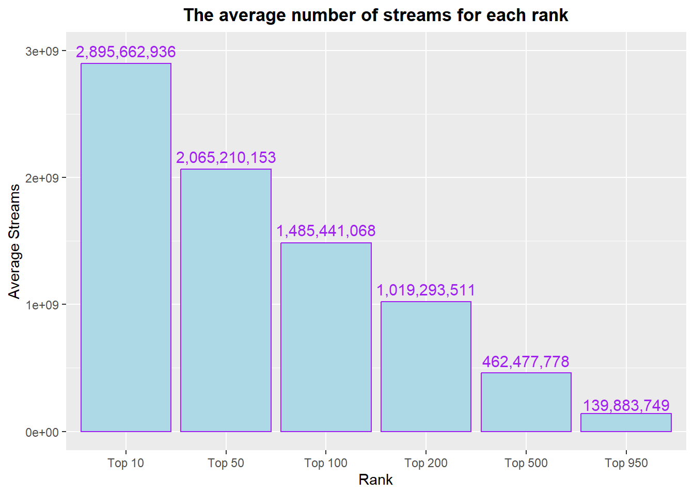
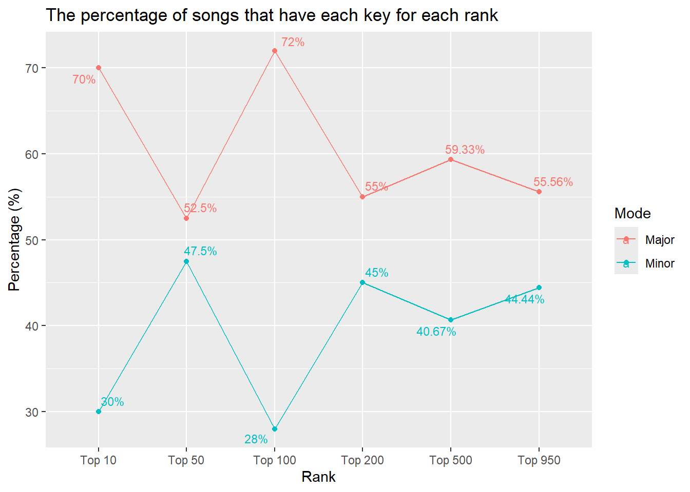

::: {.cell}

```{.r .cell-code}
library(tidyverse)
library(caret)
library(randomForest)
library(openxlsx)
library(stringr)
```
:::

::: {.cell}

```{.python .cell-code}
from types import GeneratorType
import pandas as pd
import altair as alt
import numpy as np
import seaborn as sns

from sklearn.model_selection import train_test_split
from sklearn.naive_bayes import GaussianNB
from sklearn.ensemble import RandomForestClassifier
from sklearn.ensemble import GradientBoostingClassifier
from sklearn.tree import DecisionTreeClassifier
from sklearn import metrics
```
:::


## Background

It would be difficult to find a person that does not or has never listened to music. On streaming services, movies, commercials, toys, or the person beside you humming a song, music is everywhere and the artists who make these songs aim to have their songs hit the top charts. 

This makes us think, what can an artist do to make his songs one of the best. Are there variables that affect how high a song gets on the charts.

We will focus on the Spotify charts and specifically the top 100 then analyze if there are variables that affect a songs position.


::: {.cell}

```{.r .cell-code}
top_spotify <- read.csv("C:/Users/chidu/OneDrive/Documents/Data Wrangling & visualization DS350/Data/spotify-2023.csv")
```
:::

::: {.cell}

```{.r .cell-code}
top_spotify$streams <- as.numeric(top_spotify$streams)
top_spotify$in_deezer_playlists <- as.numeric(top_spotify$in_deezer_playlists)

top_spotify$in_shazam_charts <- as.numeric(top_spotify$in_shazam_charts)

spotify <- top_spotify %>% 
  arrange(desc(streams))%>% 
  mutate(
  multiple_artist = case_when(
  artist_count <= 1 ~ 0,
  artist_count > 1 ~ 1
), top100 = case_when(
  row_number() < 101 ~ 1, 
  row_number() > 100 ~ 0
), rank = case_when(
    row_number() <= 10 ~ "Top 10",
    row_number() <= 50 ~ "Top 50",
    row_number() <= 100 ~ "Top 100",
    row_number() <= 200 ~ "Top 200",
    row_number() <= 500 ~ "Top 500",
    row_number() <= 950 ~ "Top 950",
    TRUE ~ "Other")) %>%
  
  pivot_wider(names_from = mode, values_from = mode, values_fn = length, values_fill = 0) 

spotify$key <- ifelse(spotify$key == "", "N", spotify$key)

spotify <- spotify %>% pivot_wider(names_from = key, values_from = key, values_fn = length, values_fill = 0)

spotify <- select(spotify, -N)

spotify <- spotify[complete.cases(spotify$top100), ]

## change column names that have special characters.
spotify <- spotify %>% rename(CSharp = 'C#', FSharp = 'F#', GSharp = 'G#', ASharp = 'A#', DSharp = 'D#')

spotify$artist.s._name <- str_to_lower(spotify$artist.s._name)

spotify <- spotify %>% 
  mutate(taylor_swift = ifelse(str_detect(artist.s._name, "taylor swift"), 1, 0),
         bad_bunny = ifelse(str_detect(artist.s._name, "bad bunny"), 1, 0),
         the_weeknd = ifelse(str_detect(artist.s._name, "the weeknd"), 1, 0),
         drake = ifelse(str_detect(artist.s._name, "drake"), 1, 0), 
         peso_pluma = ifelse(str_detect(artist.s._name, "peso pluma"), 1, 0))

spotify$rank <- factor(spotify$rank, levels = c("Top 10", "Top 50", "Top 100", "Top 200", "Top 500", "Top 950"))

write.csv(spotify, "spotify_data.csv", row.names = FALSE)
```
:::


## Analysis - Look into some music variables

We will look into some of the variables that we would probably be interested in. 

#### Streams

We will make a simple visual to show explore a little into streams as a variable.


::: {.cell}

```{.r .cell-code}
rank_streams <- spotify %>% group_by(rank) %>% 
  summarise(average_s = mean(streams, na.rm = TRUE)) %>% na.omit()

ggplot(rank_streams, aes(x=rank, y=average_s)) +
  geom_col(color = "purple", fill = "lightblue") +
  
  labs(x="Rank",
       y="Average Streams",
       title = "The average number of streams for each rank") +
  
  annotate("text", x = 1, y = 2995662940, label = "2,895,662,936", color = "purple", size = 4) +
  
  annotate("text", x = 2, y = 2165210153, label = "2,065,210,153", color = "purple", size = 4) +
  
  annotate("text", x = 3, y = 1585441068, label = "1,485,441,068", color = "purple", size = 4) +
  
  annotate("text", x = 4, y = 1119293511, label = "1,019,293,511", color = "purple", size = 4) +
  
  annotate("text", x = 5, y = 557477778, label = "462,477,778", color = "purple", size = 4) +
  
  annotate("text", x = 6, y = 209883749, label = "139,883,749", color = "purple", size = 4) +
  
  theme(plot.title = element_text(face = "bold", hjust=0.5))
```

::: {.cell-output-display}
{width=672}
:::
:::


The above graph shows the average streams for each `rank` category. As we would expect, the number of streams increases the higher the rank, so they are directly proportional. The number of streams was actually used to place songs in their respective ranks. 

#### Key

We will look to see if the key of the song (major or minor) has an effect on the rank of the song.


::: {.cell}

```{.r .cell-code}
percent_mode <- spotify %>% 
  group_by(rank) %>% 
  summarise(Major = mean(Major) * 100,
            Minor = mean(Minor) * 100) %>% 
  filter(rank != "Other")
percent_mode$rank <- factor(percent_mode$rank, levels = c("Top 10", "Top 50", "Top 100", "Top 200", "Top 500", "Top 950"))

percent_mode <- percent_mode %>% 
  pivot_longer(cols = 2:3, names_to = "mode", 
               values_to = "percentage", values_drop_na = TRUE)


ggplot(percent_mode, aes(x=rank, y=percentage, color = mode)) +
  geom_point() +
  
  geom_line(mapping=aes(group = mode)) +
  
  ggrepel::geom_text_repel(aes(label =  paste0(round(percentage, 2), "%")), size =3, data = percent_mode) +
  
  labs(x="Rank",
       y="Percentage (%)",
       color = "Mode",
       title = "The percentage of songs that have each key for each rank") 
```

::: {.cell-output-display}
{width=672}
:::
:::


From the above plot, we see that the percentage for each key varies based on the rank category. 
Looking at the top 100, we see that 72% of songs in this category has a `Major key` while the remaining 28% have a minor key. This would mean that a song would have a better chance being in the top 100 if it has a `Major key` 

## Making a Model - to predict if a song is in top 100

To investigate into this more, we will make a model that would predict if a song would make it to the top 100. This would help to know what variables have a greater effect of a song hitting top 100, which would sound the effect on a song going higher in the charts. 

For the model, Random Forest classification was used mainly because the data had continuous and categorical variables. 


::: {.cell}

```{.python .cell-code}
file_path = r"C:\Users\chidu\OneDrive\Documents\Data Wrangling & visualization DS350\DS350_WI24_Orizu_Davi\spotify_data.csv"

# Read the CSV file into a DataFrame, specifying the encoding
spotify2 = pd.read_csv(file_path, encoding="latin1")

# Iterate over column names and remove periods
new_column_names = [col.replace('.', '') for col in spotify2.columns]

# Rename the columns with the new names
spotify2 = spotify2.rename(columns=dict(zip(spotify2.columns, new_column_names)))

spotify2['in_deezer_playlists'] = spotify2['in_deezer_playlists'].astype(float)

spotify2['in_shazam_charts'] = spotify2['in_shazam_charts'].astype(float)

spotify2.dropna(inplace=True)
```
:::

::: {.cell}

```{.python .cell-code}
x = spotify2.filter(["artist_count", "released_year", "released_month", "released_day", "in_spotify_playlists", "in_spotify_charts", "in_apple_playlists", "in_apple_charts", "in_deezer_playlists", "in_deezer_charts", "in_shazam_charts", "bpm", "danceability_", "valence_", "energy_", "acousticness_", "instrumentalness_", "liveness_", "speechiness_", "multiple_artist", "Major", "Minor", "F", "D", "the_weeknd"])

y = spotify2.top100
```
:::

::: {.cell}

```{.python .cell-code}
x_train, x_test, y_train, y_test = train_test_split(x, y, test_size = .34, random_state = 76)
```
:::

::: {.cell}
::: {.cell-output-display}

```{=html}
<style>#sk-container-id-1 {color: black;}#sk-container-id-1 pre{padding: 0;}#sk-container-id-1 div.sk-toggleable {background-color: white;}#sk-container-id-1 label.sk-toggleable__label {cursor: pointer;display: block;width: 100%;margin-bottom: 0;padding: 0.3em;box-sizing: border-box;text-align: center;}#sk-container-id-1 label.sk-toggleable__label-arrow:before {content: "▸";float: left;margin-right: 0.25em;color: #696969;}#sk-container-id-1 label.sk-toggleable__label-arrow:hover:before {color: black;}#sk-container-id-1 div.sk-estimator:hover label.sk-toggleable__label-arrow:before {color: black;}#sk-container-id-1 div.sk-toggleable__content {max-height: 0;max-width: 0;overflow: hidden;text-align: left;background-color: #f0f8ff;}#sk-container-id-1 div.sk-toggleable__content pre {margin: 0.2em;color: black;border-radius: 0.25em;background-color: #f0f8ff;}#sk-container-id-1 input.sk-toggleable__control:checked~div.sk-toggleable__content {max-height: 200px;max-width: 100%;overflow: auto;}#sk-container-id-1 input.sk-toggleable__control:checked~label.sk-toggleable__label-arrow:before {content: "▾";}#sk-container-id-1 div.sk-estimator input.sk-toggleable__control:checked~label.sk-toggleable__label {background-color: #d4ebff;}#sk-container-id-1 div.sk-label input.sk-toggleable__control:checked~label.sk-toggleable__label {background-color: #d4ebff;}#sk-container-id-1 input.sk-hidden--visually {border: 0;clip: rect(1px 1px 1px 1px);clip: rect(1px, 1px, 1px, 1px);height: 1px;margin: -1px;overflow: hidden;padding: 0;position: absolute;width: 1px;}#sk-container-id-1 div.sk-estimator {font-family: monospace;background-color: #f0f8ff;border: 1px dotted black;border-radius: 0.25em;box-sizing: border-box;margin-bottom: 0.5em;}#sk-container-id-1 div.sk-estimator:hover {background-color: #d4ebff;}#sk-container-id-1 div.sk-parallel-item::after {content: "";width: 100%;border-bottom: 1px solid gray;flex-grow: 1;}#sk-container-id-1 div.sk-label:hover label.sk-toggleable__label {background-color: #d4ebff;}#sk-container-id-1 div.sk-serial::before {content: "";position: absolute;border-left: 1px solid gray;box-sizing: border-box;top: 0;bottom: 0;left: 50%;z-index: 0;}#sk-container-id-1 div.sk-serial {display: flex;flex-direction: column;align-items: center;background-color: white;padding-right: 0.2em;padding-left: 0.2em;position: relative;}#sk-container-id-1 div.sk-item {position: relative;z-index: 1;}#sk-container-id-1 div.sk-parallel {display: flex;align-items: stretch;justify-content: center;background-color: white;position: relative;}#sk-container-id-1 div.sk-item::before, #sk-container-id-1 div.sk-parallel-item::before {content: "";position: absolute;border-left: 1px solid gray;box-sizing: border-box;top: 0;bottom: 0;left: 50%;z-index: -1;}#sk-container-id-1 div.sk-parallel-item {display: flex;flex-direction: column;z-index: 1;position: relative;background-color: white;}#sk-container-id-1 div.sk-parallel-item:first-child::after {align-self: flex-end;width: 50%;}#sk-container-id-1 div.sk-parallel-item:last-child::after {align-self: flex-start;width: 50%;}#sk-container-id-1 div.sk-parallel-item:only-child::after {width: 0;}#sk-container-id-1 div.sk-dashed-wrapped {border: 1px dashed gray;margin: 0 0.4em 0.5em 0.4em;box-sizing: border-box;padding-bottom: 0.4em;background-color: white;}#sk-container-id-1 div.sk-label label {font-family: monospace;font-weight: bold;display: inline-block;line-height: 1.2em;}#sk-container-id-1 div.sk-label-container {text-align: center;}#sk-container-id-1 div.sk-container {/* jupyter's `normalize.less` sets `[hidden] { display: none; }` but bootstrap.min.css set `[hidden] { display: none !important; }` so we also need the `!important` here to be able to override the default hidden behavior on the sphinx rendered scikit-learn.org. See: https://github.com/scikit-learn/scikit-learn/issues/21755 */display: inline-block !important;position: relative;}#sk-container-id-1 div.sk-text-repr-fallback {display: none;}</style><div id="sk-container-id-1" class="sk-top-container"><div class="sk-text-repr-fallback"><pre>RandomForestClassifier(max_depth=50)</pre><b>In a Jupyter environment, please rerun this cell to show the HTML representation or trust the notebook. <br />On GitHub, the HTML representation is unable to render, please try loading this page with nbviewer.org.</b></div><div class="sk-container" hidden><div class="sk-item"><div class="sk-estimator sk-toggleable"><input class="sk-toggleable__control sk-hidden--visually" id="sk-estimator-id-1" type="checkbox" checked><label for="sk-estimator-id-1" class="sk-toggleable__label sk-toggleable__label-arrow">RandomForestClassifier</label><div class="sk-toggleable__content"><pre>RandomForestClassifier(max_depth=50)</pre></div></div></div></div></div>
```

:::
:::


#### Accuracy result

After running the model:


::: {.cell}

```{.python .cell-code}
# test how accurate predictions are
print("Accuracy:", metrics.accuracy_score(y_test, y_predictions))
```

::: {.cell-output .cell-output-stdout}
```
Accuracy: 0.9716312056737588
```
:::
:::

::: {.cell}

```{.python .cell-code}
feature_df = pd.DataFrame({'features':x.columns, 'importance':classifier.feature_importances_})


feature_df.to_excel('stfy_importance.xlsx', index=False) 
```
:::


#### The level of importance of each variable

A key reason for making this model was to see what variables are of most importance to the model, so the below show a bar chart of the importance of most variables ordered. 


::: {.cell}

```{.r .cell-code}
importance_df <- read.xlsx("C:/Users/chidu/OneDrive/Documents/Data Wrangling & visualization DS350/DS350_WI24_Orizu_Davi/week_14/stfy_importance.xlsx")
```
:::

::: {.cell}

```{.r .cell-code}
ggplot(importance_df, aes(x=importance, y=reorder(features, importance))) +
  geom_col(color="black", fill="purple") +
  labs(x = "Importance", y = "Variable",
       title = "Importance scale of each variable")
```

::: {.cell-output-display}
{width=672}
:::
:::


From the above chart, we can see what variables are of most importance. It appears that the number of times a sound is in Deezer playlists has a large impacts on how high in the charts a sound goes (Deezer is a French music streaming service). 

A song being in Spotify and apple playlists also have an impact on the song's performance. This is probably because a song being in a playlists means it gets listened to more. 

Another interesting finding is the if `The weekend` a R&B artist is on a song it has an impact on the song's place in the charts.

There were some variables that did not have much of an impact of the songs like: some of the key, multiple artists being on the track

## Exploring some variables

We will look into some of the variables to see the patterns. 

#### Deezer playlists

we explored the variable of the number of Deezer playlists the song is in. The plot before shows its relationship with streams. 


::: {.cell}

```{.r .cell-code}
ggplot(spotify, aes(x=in_deezer_playlists, y=streams)) +
  
  geom_point(color = "lightblue") +
  
  geom_smooth(method = "lm", se = FALSE, color = "purple", size = 1) + 
  
  scale_y_continuous(breaks = c(0, 1000000000, 2000000000, 3000000000), label = c("0", "1 Billion", "2 Billion", "3 Billion")) +
  
  labs(x= "Count in deezer playlists",
       y="Streams",
       title = "The relationship between the number of streams and the number of deezer playlists")
```

::: {.cell-output-display}
{width=672}
:::
:::


From the graph, we see that it the variables have a linear relationship. This means that being in Deezer playlist is direct proportional to the number of streams. This means that as the number in Deezer playlist increses, the number of stresms increases. 


